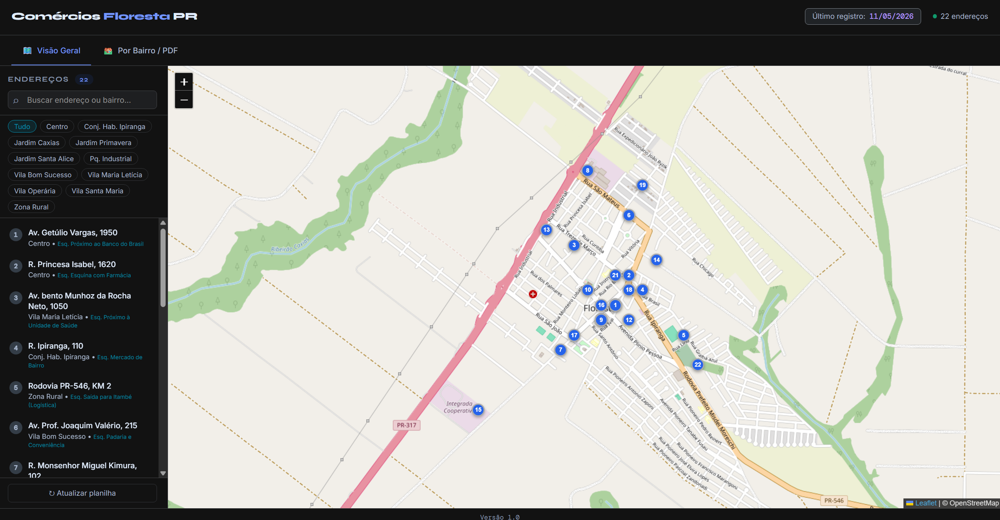

# 📍 Sistema de Mapeamento Comercial - Floresta/PR

Este projeto é uma ferramenta interativa para visualização e exportação de dados comerciais da cidade de Floresta, Paraná. Ele consome dados diretamente de uma planilha Google Sheets e permite a geração de relatórios personalizados em PDF com mapas integrados.

## 🚀 Link do Projeto
Para uma melhor experiência, acesse o sistema em uma nova aba: 
<a href="https://julianasodata.github.io/mapa-comercial-floresta-pr/" target="_blank" rel="noopener noreferrer">Acessar Mapa Comercial Interativo</a>

## ✨ Funcionalidades
- **Mapa Interativo:** Visualização de pontos comerciais utilizando Leaflet.js e OpenStreetMap.
- **Sincronização Dinâmica:** Consome dados em tempo real de um arquivo CSV hospedado no Google Sheets.
- **Relatórios Inteligentes:** Geração de PDFs segmentados por bairro, incluindo captura de imagem do mapa (html2canvas + html2pdf).
- **Interface Responsiva:** Adaptado para dispositivos móveis com tema moderno "Slate & Indigo".

## 🛠️ Tecnologias Utilizadas
- **HTML5 / CSS3:** Estrutura e estilização customizada com fontes Google Fonts (Syne e Inter).
- **JavaScript (Vanilla):** Lógica de consumo de API e manipulação do DOM.
- **Leaflet.js:** Biblioteca para mapas interativos.
- **html2pdf.js & html2canvas:** Bibliotecas para conversão de elementos HTML em documentos PDF.

## 📁 Como Executar
1. Clone este repositório: `git clone https://github.com/seu-usuario/nome-do-repo.git`
2. Abra o arquivo `index.html` em qualquer navegador moderno.

---
Desenvolvido por **Juliana Santos** | <a href="www.linkedin.com/in/julianasodata" target="_blank" rel="noopener noreferrer">Conectar no LinkedIn</a>

## 📸 Demonstração

